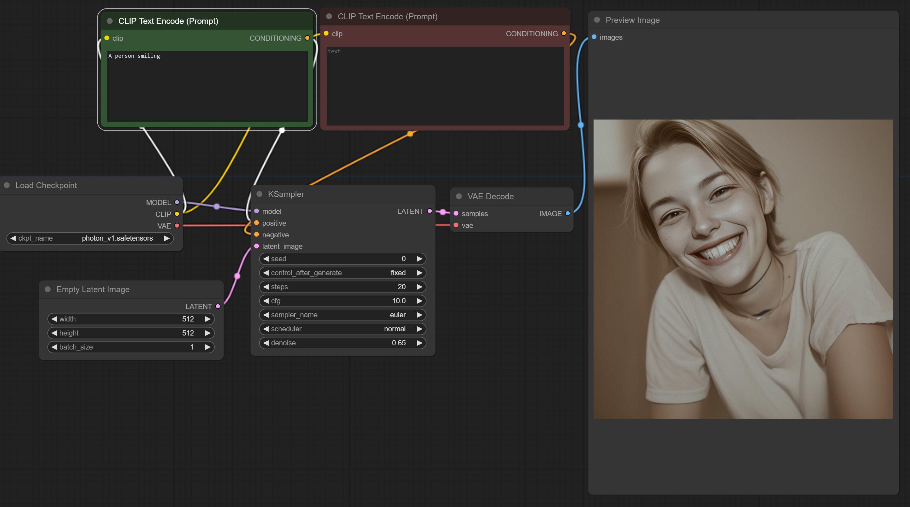
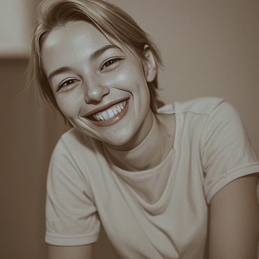

# Enlaces de interés
[Descarga ComfyUI](https://github.com/comfyanonymous/ComfyUI)

[Descarga Modelo Photon](https://civitai.com/models/84728/photon)

[Librería de modelos](https://huggingface.co/models)

# Librerías
Pese a que existen muchos lugares desde los que podemos descargar modelos, vamos a ver una de las librerías más usadas. [Hugging Face](https://huggingface.co/models) nos permitirá usar modelos de muchos tipos.

También tenemos [civitai](https://civitai.com), otra plataforma cargada de modelos y otras funcionalidades.

El requisito para poder encontrar algo, es saber qué estás buscando. Verás que hay infinidad de inteligencias.

## Nuestro modelo: Photon V1
Vamos a usar un modelo de otra librería, civitai. Dicho modelo es una versión reducida del modelo de Stable Diffusion. 

[Descargar Modelo Photon](https://civitai.com/models/84728/photon)

# ComfyUI

## Introducción

ComfyUI es una interfaz gráfica de usuario para modelos de inteligencia artificial generativos, que permite a los usuarios construir y personalizar flujos de trabajo utilizando nodos modulares. Esta herramienta es especialmente útil para experimentar con diferentes configuraciones y comprender mejor cómo interactúan los componentes de un modelo de IA.

## Nodos más usados en ComfyUI

### Load Checkpoint - Modelo

**¿Aplicable a LLMs?** Sí

El nodo **Load Checkpoint** se utiliza para cargar un modelo preentrenado desde un archivo de punto de control (checkpoint). Este modelo contiene los parámetros entrenados que el sistema utilizará para generar resultados.

- **Modelo:** Es el archivo que almacena los pesos y biases del modelo de IA. Puede ser un modelo de difusión, un modelo de lenguaje grande (LLM) u otros tipos de modelos preentrenados.
#### ¿Qué es un modelo de difusión?

Un **modelo de difusión** es un tipo de modelo generativo que aprende a crear datos nuevos similares a un conjunto de datos de entrenamiento mediante un proceso de difusión inversa. Inicialmente, el modelo añade ruido gaussiano de forma incremental a los datos de entrenamiento hasta que se convierten en ruido puro. Luego, aprende a invertir este proceso de difusión, eliminando gradualmente el ruido para generar datos nuevos y coherentes.

Estos modelos son especialmente efectivos en la generación de imágenes y han sido fundamentales en avances recientes en inteligencia artificial generativa, como la creación de imágenes realistas a partir de descripciones textuales.

### CLIP Text Encode (Prompt)

**¿Aplicable a LLMs?** Sí

El nodo **CLIP Text Encode** convierte texto en vectores de características que pueden ser entendidos por el modelo de IA para generar contenido.

- **Prompt:** Es la entrada de texto que guía al modelo sobre qué generar.
- **Prompt Positivo/Negativo:** Los prompts positivos enfatizan características deseadas en la salida, mientras que los negativos indican qué evitar.

### Empty Latent Image

**¿Aplicable a LLMs?** No directamente

Este nodo genera una imagen latente vacía que sirve como punto de partida para la generación de imágenes.

- **Width (Ancho):** Define la anchura de la imagen en píxeles.
- **Height (Altura):** Define la altura de la imagen en píxeles.
- **Batch_size:** Especifica el número de imágenes que se generarán simultáneamente.

### VAE Encode

**¿Aplicable a LLMs?** No directamente

El nodo **VAE Encode** transforma una imagen en una representación latente utilizando un Autoencoder Variacional (VAE).
#### ¿Qué es una representación latente?

Una **representación latente** es una forma compacta y abstracta de datos que captura las características esenciales pero no observables directamente de la información original. En el contexto de modelos de IA, los datos (como imágenes o texto) se transforman en este espacio latente para facilitar el procesamiento y la generación.

El espacio latente permite al modelo manipular y operar sobre las características fundamentales de los datos, lo que es útil para tareas como la generación de contenido, la interpolación entre datos y la comprensión de estructuras subyacentes.

Estos algoritmos son esenciales para hacer que los modelos de difusión sean prácticos en aplicaciones del mundo real, ya que reducen el tiempo de cómputo necesario para generar nuevas muestras.

Tienes más info al final de este documento :)

- **VAE:** Un modelo que aprende a codificar y decodificar datos, capturando la distribución de los mismos en un espacio latente.

### VAE Decode

**¿Aplicable a LLMs?** No directamente

El nodo **VAE Decode** toma muestras latentes y las transforma de vuelta en imágenes.

- **SAMPLES (Muestras):** Los datos latentes que serán decodificados para generar imágenes.

### KSampler

**¿Aplicable a LLMs?** Sí, en conceptos similares

El nodo **KSampler** es crucial para el proceso de generación, ya que controla cómo se muestrean las distribuciones latentes.

- **Seed (Semilla):** Un número que inicializa el generador aleatorio para obtener resultados reproducibles.
- **Control_after_generate:** Determina si se aplicarán controles adicionales después de la generación inicial.
- **Steps (Pasos):** Número de iteraciones que el modelo utilizará para refinar la salida.
- **CFG (Classifier-Free Guidance):** Ajusta el equilibrio entre seguir el prompt y la creatividad del modelo.
- **Sampler_name (Nombre del muestreador):** Especifica el algoritmo de muestreo a utilizar, como DDIM o PLMS.
- **Scheduler (Programador):** Controla cómo se ajustan los parámetros durante el muestreo.
- **Denoise (Desenfoque):** Nivel de reducción de ruido aplicado durante la generación para mejorar la calidad de la imagen.

#### ¿Qué es DDIM o PLMS?

**DDIM** (Denoising Diffusion Implicit Models) y **PLMS** (Pseudo Linear Multi-Step) son algoritmos de muestreo utilizados en modelos de difusión para generar datos a partir del espacio latente.

- **DDIM:** Es un método de muestreo que permite una generación más rápida y eficiente al reducir el número de pasos necesarios para eliminar el ruido del proceso de difusión. Mantiene la calidad de la generación mientras acelera el proceso.

- **PLMS:** Es otro algoritmo de muestreo que mejora la eficiencia del muestreo multiescalado. Utiliza métodos numéricos avanzados para acelerar el proceso de generación sin comprometer la calidad del resultado final.

# Ejemplos de Representación Latente

## Comprendiendo el Espacio Latente a través de Ejemplos

Una **representación latente** es una forma de codificar información compleja en un formato numérico simplificado que captura las características esenciales de los datos originales. Es como traducir datos de alta dimensión (imágenes, texto, audio) en un "idioma" que el modelo de IA puede entender y manipular fácilmente.

Vamos con unos ejemplos, para hacerlo más fácil.

### Ejemplo 1: Imagen de un Gato

**Paso 1: Codificación en el Espacio Latente**

- **Imagen Original:** Una foto de un gato con pelo naranja, ojos verdes y sentado en posición erguida.
- **Representación Latente:** El modelo convierte esta imagen en un vector numérico que captura características como color del pelaje, forma de los ojos, postura y otras propiedades visuales.

**Paso 2: Manipulación en el Espacio Latente**

- **Interpolación:** Al modificar el vector latente, podemos cambiar el color del pelaje de naranja a gris, o ajustar la postura de sentado a acostado.
- **Generación de Nuevas Imágenes:** Combinando vectores latentes de diferentes gatos, el modelo puede generar imágenes de gatos con características mixtas.

**Visualización:**

Imagina que cada dimensión en el espacio latente representa una característica: una para el color del pelaje, otra para la forma de las orejas, otra para la postura, etc. Moviéndonos en este espacio, podemos explorar todas las variaciones posibles de gatos.

### Ejemplo 2: Imagen de "El Señor de los Anillos"

**Paso 1: Codificación en el Espacio Latente**

- **Imagen Original:** Una escena de "El Señor de los Anillos" que muestra a Gandalf luchando contra el Balrog en el puente de Khazad-dûm.
- **Representación Latente:** El modelo transforma esta imagen en un vector que captura elementos como los personajes presentes, el entorno (una cueva), la iluminación (fuego y sombras), y la acción (una batalla).

**Paso 2: Manipulación en el Espacio Latente**

- **Cambio de Escenario:** Al ajustar las dimensiones relacionadas con el entorno, podemos transformar la escena para que ocurra en un bosque en lugar de una cueva.
- **Alteración de Personajes:** Modificando las dimensiones asociadas con los personajes, podríamos reemplazar a Gandalf con Frodo o cambiar al Balrog por un orco.

**Visualización:**

En el espacio latente, las imágenes de "El Señor de los Anillos" se agrupan según sus similitudes. Las escenas de batallas están cerca unas de otras, mientras que las escenas tranquilas en la Comarca están en otra región del espacio. Esto permite al modelo generar nuevas imágenes coherentes dentro del universo de la historia.

## En resumen

El espacio latente es esencialmente el "taller" del modelo de IA, donde las características importantes de los datos se representan numéricamente. Al manipular estos números, el modelo puede generar, modificar y combinar datos de maneras creativas y controladas, ya sea cambiando el color de un gato o creando nuevas escenas en un universo de fantasía como "El Señor de los Anillos".

# Detalle de los Samplers en ComfyUI

## Introducción

En los modelos de difusión utilizados en ComfyUI, el proceso de generación de imágenes a partir del espacio latente implica el uso de algoritmos de muestreo, conocidos como **samplers**. Estos samplers determinan cómo se elimina gradualmente el ruido añadido a una imagen latente para obtener una imagen final coherente y de alta calidad.

Vamos a ver en detalle los samplers disponibles en ComfyUI de forma predeterminada, junto con una descripción algorítmica y su origen.

Además, voy a usar la siguiente configuración en ComfyUI usando el modelo Photon v1 para que podamos ver la diferencia entre resultados :)

Mediré el tiempo de carga como "1" en el caso de DDIM y el resto de tiempos de carga serán un multiplicador. De tal forma que un tiempo de carga de "2" significa que tarda el doble y de "0.5" que tarda la mitad que el DDIM.

## Samplers Disponibles en ComfyUI

### 1. DDIM (Denoising Diffusion Implicit Models)

**Descripción:**

DDIM es un algoritmo de muestreo que permite una generación más rápida y eficiente en modelos de difusión, reduciendo el número de pasos necesarios sin comprometer significativamente la calidad de la imagen generada.

**Algoritmo:**

- **Proceso Determinista:** A diferencia de otros samplers estocásticos, DDIM utiliza un enfoque determinista para el muestreo.
- **Reducción de Pasos:** Permite utilizar menos pasos (steps) al aprovechar una reformulación matemática del proceso de difusión inversa.
- **Interpolación Lineal:** Utiliza una ecuación de muestreo que interpola linealmente entre el ruido y la imagen objetivo.

**Origen:**

- Propuesto por Jiaming Song y colaboradores en 2020.
- Diseñado para mejorar la eficiencia de los modelos de difusión sin sacrificar la calidad de las muestras.

**Ejemplo:**
- Tiempo de carga: 1
- Resultado:

### 2. PLMS (Pseudo Linear Multi-Step)

**Descripción:**

PLMS es un algoritmo que mejora la eficiencia del muestreo multiescalado utilizando métodos numéricos avanzados para acelerar el proceso de generación.

**Algoritmo:**

- **Método Multipasos:** Utiliza información de varios pasos anteriores para predecir el siguiente estado, similar a métodos numéricos como Adams-Bashforth.
- **Estimación de Gradientes:** Calcula gradientes en pasos anteriores y los combina para una mejor aproximación.
- **Eficiencia Mejorada:** Al considerar múltiples pasos, puede lograr resultados de alta calidad con menos iteraciones.

**Origen:**

- Basado en técnicas de métodos numéricos aplicados a ecuaciones diferenciales estocásticas.
- Adaptado para modelos de difusión para mejorar la velocidad sin perder calidad.

**Ejemplo:**
- Tiempo de carga: 1
- Resultado:

### 3. Euler y Euler Ancestral (Euler a)

**Descripción:**

Estos samplers están basados en el método de Euler para resolver ecuaciones diferenciales, adaptados al proceso de difusión inversa en modelos generativos.

**Algoritmo:**

- **Euler:**
  - **Paso Simple:** Calcula el siguiente estado utilizando la derivada actual.
  - **Fórmula Básica:** `x_{t-1} = x_t + f(x_t, t) * Δt`, donde `f` es una función que representa el gradiente.

- **Euler Ancestral (Euler a):**
  - **Proceso Estocástico:** Añade ruido en cada paso para introducir variabilidad en las muestras.
  - **Considera Trayectorias Ancestrales:** Incorpora información de estados anteriores para mejorar la diversidad.

**Origen:**

- Basado en el método de Euler clásico de resolución de ecuaciones diferenciales.
- Adaptado para modelos de difusión por investigadores en IA generativa.

**Ejemplo:**
- Tiempo de carga: 1
- Resultado:

### 4. Heun

**Descripción:**

El sampler Heun es una variante de segundo orden del método de Euler, que ofrece mayor precisión en la aproximación de soluciones.

**Algoritmo:**

- **Método de Predictor-Corrector:**
  - **Predicción:** Calcula una estimación preliminar del siguiente estado (como en Euler).
  - **Corrección:** Ajusta esta estimación utilizando la pendiente promedio entre el estado actual y el predicho.
- **Fórmula:**
  - **Predicción:** `x_{t-1}^{'} = x_t + f(x_t, t) * Δt`
  - **Corrección:** `x_{t-1} = x_t + 0.5 * (f(x_t, t) + f(x_{t-1}^{'}, t-1)) * Δt`

**Origen:**

- Derivado del método de Heun para resolver ecuaciones diferenciales ordinarias.
- Proporciona un balance entre eficiencia computacional y precisión en modelos de difusión.

**Ejemplo:**
- Tiempo de carga: 2
- Resultado:

### 5. DPM2 y DPM2 Ancestral (DPM2 a)

**Descripción:**

Los samplers DPM2 están diseñados específicamente para mejorar el muestreo en modelos de difusión, ofreciendo mayor precisión y eficiencia.

**Algoritmo:**

- **DPM2:**
  - **Segundo Orden:** Utiliza un esquema de muestreo de segundo orden para una mejor aproximación.
  - **Método Implícito:** Calcula el siguiente estado considerando tanto la información actual como la futura.

- **DPM2 Ancestral (DPM2 a):**
  - **Estocasticidad Añadida:** Introduce ruido adicional para mejorar la diversidad de las muestras.
  - **Información Ancestral:** Considera estados previos para influir en la generación actual.

**Origen:**

- Basado en investigaciones recientes en modelos de difusión probabilística.
- Desarrollado para superar limitaciones de samplers anteriores en términos de calidad y velocidad.

**Ejemplo:**
- Tiempo de carga: 2
- Resultado:

## ¿De Dónde Provienen Estos Algoritmos?

Estos algoritmos provienen de:

- **Investigación en Aprendizaje Automático:** Los samplers son el resultado de adaptar y optimizar métodos numéricos y estadísticos para el contexto de modelos de difusión.
- **Métodos Numéricos Clásicos:** Muchos samplers se basan en métodos tradicionales de resolución de ecuaciones diferenciales, ajustados para procesos estocásticos.
- **Innovación en IA Generativa:** La necesidad de generar muestras de alta calidad de manera eficiente ha impulsado el desarrollo de nuevos algoritmos de muestreo.

## ¿Son Inherentes al Modelo?

- **No Son Inherentes al Modelo:** Los samplers no forman parte de los parámetros aprendidos del modelo. Son técnicas utilizadas durante el proceso de generación para interactuar con el modelo entrenado.
- **Intercambiables:** Puedes cambiar el sampler sin necesidad de reentrenar el modelo. Diferentes samplers pueden producir resultados ligeramente distintos utilizando el mismo modelo.
- **Función de Interfaz:** Actúan como una interfaz que traduce la información del espacio latente a datos observables (por ejemplo, imágenes), controlando cómo se realiza la eliminación de ruido.

## Conclusión

Los **samplers** desempeñan un papel crucial en el proceso de generación en modelos de difusión utilizados en ComfyUI. Aunque no son inherentes al modelo, influyen significativamente en la calidad y velocidad de las imágenes generadas. Entender cómo funcionan y de dónde provienen permite a los usuarios seleccionar el sampler más adecuado para sus necesidades específicas, optimizando así los resultados obtenidos.

