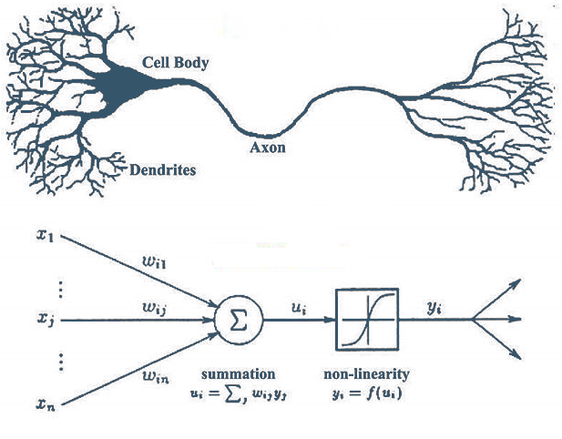
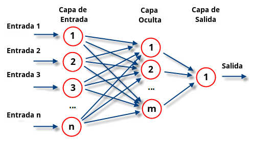
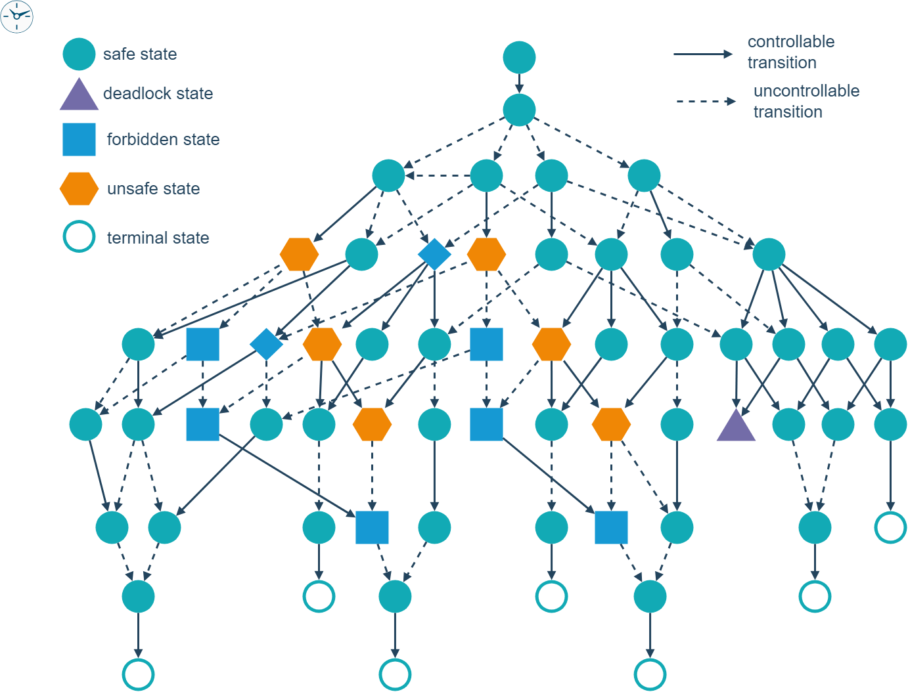

# Introducción a la IA

## Tipos de datos

En el contexto de la inteligencia artificial (IA), los datos son fundamentales para entrenar modelos y tomar decisiones automatizadas. Los tipos de datos se dividen en dos categorías principales:

- **Estructurados**: Son aquellos datos que se organizan en un formato predefinido y conocido, como tablas en bases de datos relacionales. Cada dato se almacena en un campo fijo y tiene un tipo de dato específico, como números enteros, cadenas de texto o fechas. Ejemplos incluyen:

  - Bases de datos SQL.
  - Hojas de cálculo de Excel.
  - Datos de sensores con registros consistentes (por ejemplo, temperatura, humedad).

  La estructura facilita el análisis y la consulta mediante lenguajes como SQL, y es ideal para tareas de análisis descriptivo, predictivo, y la implementación de modelos de machine learning clásicos, como la regresión lineal.

- **No estructurados**: Estos datos no siguen un formato predefinido o consistente. Pueden incluir una gran variedad de tipos de información que no se pueden almacenar fácilmente en una base de datos relacional. Ejemplos incluyen:

  - Imágenes y videos.
  - Texto de redes sociales o artículos.
  - Archivos de audio.
  - Correo electrónico.

  Debido a su naturaleza variada, los datos no estructurados requieren técnicas avanzadas de procesamiento, como el procesamiento de lenguaje natural (NLP) para textos o redes neuronales convolucionales (CNN) para imágenes.

## Evolución de la IA (Cronología y técnica)

La evolución de la IA ha sido un viaje fascinante desde las primeras ideas hasta los desarrollos tecnológicos avanzados que vemos hoy en día. A continuación, se presenta una cronología de los hitos clave en la evolución de la IA:

1. **Años 1940-1950: Nacimiento de la IA**

   - **1943**: Warren McCulloch y Walter Pitts publican un modelo de red neuronal basado en cálculos booleanos, estableciendo una de las primeras bases teóricas de la IA.
   - **1950**: Alan Turing propone el "Test de Turing" en su artículo "Computing Machinery and Intelligence", sugiriendo que una máquina puede ser considerada inteligente si su comportamiento es indistinguible del humano.

2. **Años 1950-1960: Primeras aplicaciones y optimismo**

   - **1956**: Se realiza la conferencia de Dartmouth, considerada el nacimiento formal de la IA como disciplina académica. John McCarthy, Marvin Minsky, Nathaniel Rochester y Claude Shannon participaron en este evento.
   - **1957**: Frank Rosenblatt desarrolla el "perceptrón", uno de los primeros modelos de red neuronal. Este fue un importante avance para el aprendizaje automático.

3. **Años 1970-1980: El invierno de la IA**

   - **1973**: El informe Lighthill critica severamente los progresos de la IA, lo que lleva a una reducción en la financiación y el interés, provocando el primer "invierno de la IA".
   - **Años 1980**: A pesar del escepticismo, las redes neuronales vuelven a ganar interés gracias a la invención del algoritmo de retropropagación por Geoffrey Hinton y otros.

4. **Años 1990-2000: Resurgimiento y avances**

   - **1997**: Deep Blue, un sistema de IBM, derrota al campeón mundial de ajedrez Garry Kasparov, demostrando la capacidad de las máquinas para superar a los humanos en tareas específicas.
   - **1998**: Yann LeCun desarrolla LeNet-5, una red neuronal convolucional (CNN) utilizada para reconocimiento de caracteres escritos a mano, marcando el inicio de las CNN en tareas de visión por computadora.

5. **Años 2010-Presente: Era del Deep Learning y la IA General**
   - **2012**: AlexNet, una red profunda de CNN, gana el concurso ImageNet, lo que inicia la explosión del deep learning y su aplicación en diversas áreas.
   - **2016**: AlphaGo de DeepMind vence a Lee Sedol, campeón mundial de Go, utilizando técnicas de aprendizaje profundo y refuerzo, mostrando un nuevo nivel de competencia en IA.
   - **2020 en adelante**: Modelos de lenguaje como GPT-3 y GPT-4 demuestran capacidades sorprendentes en la generación de texto natural, traduciendo, redactando, y manteniendo conversaciones complejas.

## El origen matemático

La IA, particularmente el aprendizaje automático, se basa en fundamentos matemáticos sólidos que permiten construir modelos capaces de aprender de los datos y hacer predicciones. Algunos conceptos matemáticos fundamentales incluyen:

- **Álgebra lineal**: Las matrices y vectores son esenciales en la representación de datos y operaciones en redes neuronales. La multiplicación de matrices, la descomposición en valores singulares (SVD), y la descomposición en valores propios son herramientas clave.
- **Cálculo diferencial**: Las redes neuronales se entrenan mediante la optimización de funciones de pérdida, que a menudo requieren derivadas parciales y gradientes para ajustar los pesos a través del método de retropropagación.
- **Probabilidad y estadística**: Muchos algoritmos de IA, especialmente en el aprendizaje automático, se basan en principios probabilísticos. La regresión lineal, los modelos bayesianos, y el análisis de componentes principales (PCA) son ejemplos claros.
- **Teoría de la información**: Conceptos como la entropía y la ganancia de información son fundamentales en el diseño de modelos de clasificación y toma de decisiones, como los árboles de decisión.

## El perceptron

El perceptrón es uno de los modelos más simples y fundamentales en el aprendizaje automático. Desarrollado por Frank Rosenblatt en 1957, es una red neuronal artificial básica utilizada para tareas de clasificación binaria. Conceptualmente, un perceptrón intenta emular la forma en que una neurona biológica procesa la información.

### Componentes del Perceptrón:

- **Entradas**: Conjunto de características (x1, x2, ..., xn) que representan la información de entrada.
- **Pesos**: Cada entrada se multiplica por un peso asociado (w1, w2, ..., wn), que es ajustado durante el proceso de entrenamiento.
- **Suma ponderada**: Se calcula la suma ponderada de las entradas, agregando un sesgo (bias) al resultado.
- **Función de activación**: Una función no lineal (como la función escalón) que decide si la neurona se activa (produce una salida) o no. En el caso del perceptrón original, la salida es 1 si la suma ponderada supera un umbral, y 0 en caso contrario.

### Limitaciones del Perceptrón:

- El perceptrón solo puede resolver problemas linealmente separables. Esto significa que no puede manejar casos en los que las clases no se puedan separar mediante una línea recta en el espacio de características (por ejemplo, el problema XOR).
- Sin embargo, es la base sobre la cual se construyeron modelos más complejos y capaces, como las redes neuronales multicapa (MLP), que superan estas limitaciones mediante capas adicionales y funciones de activación más sofisticadas.

## Herramientas e implicaciones

### GPU

- **Unidad de Procesamiento Gráfico (GPU)**: Las GPU son procesadores especializados diseñados para manejar múltiples operaciones en paralelo, lo que las hace extremadamente eficientes para tareas de procesamiento gráfico y, por extensión, para el entrenamiento de modelos de IA que requieren el manejo de grandes volúmenes de cálculos, como en el caso de las redes neuronales profundas.
- **Implicaciones**: El uso de GPU ha revolucionado el campo del deep learning, permitiendo entrenar modelos complejos en horas o días en lugar de semanas o meses. Además, las GPUs permiten la manipulación eficiente de grandes volúmenes de datos, lo que es esencial en la era del big data.

### Nvidia

- **Nvidia**: Es uno de los principales fabricantes de GPUs y ha jugado un papel clave en la evolución de la IA moderna. Sus productos, como las series de tarjetas gráficas Nvidia RTX y la plataforma de software CUDA, han facilitado el desarrollo de modelos de deep learning.
- **Tensor Cores**: En sus GPUs, Nvidia ha introducido Tensor Cores, que están optimizados específicamente para operaciones de tensor en redes neuronales, mejorando aún más la velocidad de entrenamiento y la eficiencia energética.

### Python

- **Python**: Es el lenguaje de programación más utilizado en el campo de la IA debido a su simplicidad, versatilidad y la vasta cantidad de bibliotecas disponibles. Entre las más relevantes para la IA se incluyen:
  - **NumPy** y **Pandas**: Para manipulación de matrices y datos.
  - **Scikit-learn**: Para algoritmos de machine learning clásicos.
  - **TensorFlow** y **PyTorch**: Para construir y entrenar redes neuronales profundas.
  - **Keras**: Una API de alto nivel que facilita la creación de modelos en TensorFlow.

### Notebooks

- **Notebooks**: Herramientas como Jupyter Notebook y Google Colab permiten a los desarrolladores escribir código Python de manera interactiva, combinando texto, visualizaciones y código en un solo documento. Son ideales para la experimentación, enseñanza y desarrollo de prototipos en IA.

## Qué es una red neuronal

### Introducción

Una **red neuronal** es un modelo computacional inspirado en la estructura y funcionamiento del cerebro humano, diseñado para reconocer patrones, aprender de los datos y tomar decisiones. Es un componente central en el campo de la inteligencia artificial (IA) y el aprendizaje automático (machine learning). Las redes neuronales son especialmente efectivas en tareas como el reconocimiento de imágenes, el procesamiento del lenguaje natural, la predicción de series temporales y más.

### Conceptos Básicos

#### Solicitud de Recursos Adicionales por Parte de los Procesos

Una **solicitud de recursos adicionales por parte de los procesos** se refiere a la petición que un proceso en ejecución hace al sistema operativo para acceder a recursos adicionales que necesita para continuar su ejecución. Estos recursos pueden ser de diferentes tipos, como tiempo de CPU, memoria, dispositivos de entrada/salida, archivos, entre otros. El sistema operativo es responsable de gestionar estas solicitudes para asegurar que se cumplan las políticas de asignación de recursos y que el sistema opere de manera eficiente sin caer en estados problemáticos como deadlocks.

##### Ejemplos de Solicitudes de Recursos Adicionales

###### 1. **Memoria**
   - **Descripción**: Un proceso que está ejecutando un programa grande puede requerir más memoria RAM a medida que necesita cargar más datos o módulos en memoria.
   - **Ejemplo**: Un programa de edición de video, al aplicar efectos o trabajar con videos de alta resolución, podría solicitar más memoria para manejar los datos adicionales.

###### 2. **Tiempo de CPU**
   - **Descripción**: Un proceso que realiza cálculos intensivos puede necesitar más tiempo de CPU para completar sus tareas.
   - **Ejemplo**: Una aplicación de simulación científica que realiza cálculos complejos podría solicitar tiempo adicional de CPU para poder finalizar las simulaciones.

###### 3. **Dispositivo de Entrada/Salida (I/O)**
   - **Descripción**: Un proceso puede necesitar acceso a dispositivos de entrada/salida, como discos duros, impresoras, o puertos de red, para leer o escribir datos.
   - **Ejemplo**: Un proceso de backup que guarda datos en un disco duro externo podría solicitar acceso adicional al dispositivo de almacenamiento para continuar con la copia de archivos.

###### 4. **Bloqueos (Locks)**
   - **Descripción**: Un proceso que necesita acceder a un recurso compartido (como un archivo o una base de datos) en un entorno concurrente puede solicitar un bloqueo para garantizar un acceso exclusivo temporal.
   - **Ejemplo**: Una aplicación de base de datos que actualiza registros podría solicitar un bloqueo en ciertas tablas para asegurar que no haya modificaciones conflictivas mientras realiza la actualización.

###### 5. **Archivos**
   - **Descripción**: Un proceso puede necesitar abrir o crear archivos adicionales durante su ejecución.
   - **Ejemplo**: Un compilador que genera archivos de código objeto y ejecutables a partir de un archivo fuente puede solicitar acceso para crear estos archivos de salida en el sistema de archivos.

###### 6. **Conexiones de Red**
   - **Descripción**: Un proceso que necesita comunicarse con otros sistemas o servicios a través de la red puede solicitar recursos adicionales para abrir conexiones de red.
   - **Ejemplo**: Un servidor web podría solicitar recursos adicionales para abrir nuevas conexiones de red cuando hay un aumento en el tráfico entrante de usuarios.

###### 7. **Recursos Gráficos**
   - **Descripción**: Un proceso que gestiona interfaces gráficas o realiza procesamiento de gráficos intensivo puede solicitar recursos adicionales como acceso a la GPU.
   - **Ejemplo**: Un videojuego con gráficos avanzados puede solicitar más recursos de la GPU para renderizar escenas complejas o en alta resolución.

#### Neurona Artificial

En el corazón de una red neuronal está la **neurona artificial**, que es un modelo matemático que simula cómo una neurona biológica procesa la información. Cada neurona recibe una o más **entradas** (inputs), las procesa a través de una función de activación, y produce una **salida** (output).

- **Entradas (Inputs)**: Representan las características o atributos de los datos de entrada (por ejemplo, los píxeles de una imagen, las palabras de una oración).
- **Pesos (Weights)**: Cada entrada se multiplica por un peso, que es ajustado durante el entrenamiento para optimizar el rendimiento del modelo.
- **Función de activación**: Una función que introduce no linealidad en la red y decide si la neurona "dispara" (activa) o no.
- **Salida (Output)**: El resultado de la función de activación, que puede ser la entrada para otras neuronas en capas sucesivas o la predicción final de la red.

#### Estructura de la Red Neuronal

Las redes neuronales están compuestas por múltiples **capas** de neuronas:

1. **Capa de Entrada**: La primera capa que recibe los datos de entrada. Cada nodo de esta capa representa una característica del conjunto de datos.
2. **Capas Ocultas**: Una o más capas entre la capa de entrada y la capa de salida. Las capas ocultas procesan las entradas de manera iterativa para extraer características complejas y patrones de los datos. Cuantas más capas ocultas tiene una red, más profunda se considera, lo que da lugar a las llamadas redes neuronales profundas (deep neural networks).
3. **Capa de Salida**: La capa final que produce la predicción o resultado de la red, como una clasificación o una regresión.

#### Propagación y Aprendizaje

- **Propagación hacia adelante (Forward Propagation)**: Es el proceso por el cual los datos de entrada se transforman en la salida a través de las capas de la red. Las entradas se multiplican por los pesos, se suman, y pasan por la función de activación en cada neurona.
- **Función de pérdida (Loss Function)**: Una función que mide la discrepancia entre la salida predicha por la red y la salida real (etiqueta). Ejemplos incluyen la entropía cruzada (cross-entropy) para clasificación y el error cuadrático medio (MSE) para regresión.
- **Retropropagación (Backpropagation)**: Es el proceso de ajuste de los pesos en la red para minimizar la función de pérdida. Utiliza el descenso de gradiente para actualizar los pesos de manera que la predicción de la red se acerque más a las etiquetas reales.

### Tipos de Redes Neuronales

Existen varios tipos de redes neuronales, cada una diseñada para diferentes tipos de problemas y datos:

- **Redes Neuronales Artificiales (ANN)**: Las redes más simples, generalmente con una o dos capas ocultas, utilizadas para tareas básicas de clasificación y regresión.
- **Redes Neuronales Convolucionales (CNN)**: Especializadas en el procesamiento de datos estructurados en forma de grillas, como imágenes.
- **Redes Neuronales Recurrentes (RNN)**: Diseñadas para datos secuenciales o temporales, como series de tiempo o procesamiento de lenguaje natural.

### Aplicaciones

Las redes neuronales tienen aplicaciones en una amplia variedad de campos, incluyendo:

- **Reconocimiento de Imágenes**: Identificación de objetos, rostros, o escenas en imágenes o videos.
- **Procesamiento de Lenguaje Natural (NLP)**: Traducción automática, análisis de sentimientos, chatbots.
- **Juegos**: IA en juegos que pueden aprender y adaptarse, como AlphaGo.
- **Predicción de Series Temporales**: Previsión de ventas, clima, o precios de acciones.

### Estados y Transiciones en Sistemas Computacionales

#### Safe State (Estado Seguro)

Un **estado seguro** es un concepto clave en la teoría de la concurrencia y en la gestión de recursos en sistemas operativos. Se refiere a un estado en el que un sistema puede garantizar que todas las solicitudes de recursos adicionales por parte de los procesos pueden ser satisfechas sin riesgo de entrar en un **deadlock** (estado de bloqueo). En otras palabras, desde un estado seguro, es posible que todos los procesos completen su ejecución eventualmente, siguiendo una secuencia de asignaciones de recursos que no comprometa la integridad del sistema.

##### Ejemplos

1. **Gestión de Recursos en un Sistema Operativo**:
   - Supongamos un sistema con tres procesos (P1, P2, P3) y 12 unidades de un recurso disponible. Si:
     - P1 está utilizando 3 unidades y puede requerir hasta 7.
     - P2 está utilizando 2 unidades y puede requerir hasta 4.
     - P3 está utilizando 2 unidades y puede requerir hasta 6.
   - El sistema está en un estado seguro si puede asignar recursos de manera que todos los procesos completen sus tareas sin bloquearse. Por ejemplo, si asigna primero los recursos necesarios a P2, luego a P3 y finalmente a P1, asegurando que en cada paso hay suficientes recursos disponibles para satisfacer las necesidades máximas de cada proceso.

2. **Sistema Bancario y Transacciones**:
   - En un banco, las transacciones financieras deben manejarse de tal manera que siempre haya suficiente capital para cubrir los retiros y transferencias solicitadas.
   - Si el banco controla y autoriza las transacciones basándose en las reservas actuales, asegurando que nunca se compromete más dinero del disponible, el sistema financiero se mantiene en un estado seguro, evitando situaciones de insolvencia o falta de liquidez.

---

#### Deadlock State (Estado de Deadlock)

Un **estado de deadlock** es una situación en un sistema donde un conjunto de procesos se encuentra en un ciclo de espera permanente, cada uno esperando un recurso que otro proceso en el ciclo ya ha adquirido. En este estado, ninguno de los procesos puede avanzar, y el sistema no puede salir de este estancamiento sin intervención externa. Este es un estado crítico que los sistemas deben evitar mediante la gestión adecuada de recursos y la planificación.

##### Ejemplos

1. **Problema de los Filosofos Comensales**:
   - Imagina cinco filósofos sentados alrededor de una mesa circular, cada uno con un plato de espaguetis y un tenedor a su izquierda y derecha (compartido con el filósofo adyacente).
   - Si cada filósofo toma el tenedor a su izquierda al mismo tiempo y luego espera indefinidamente a que el tenedor a su derecha esté disponible, ninguno podrá comer y todos permanecerán bloqueados esperando el segundo tenedor. Esto representa un deadlock clásico en la sincronización de procesos.

2. **Procesos Concurrentes Solicitando Recursos Mutuamente**:
   - Proceso A tiene el recurso R1 y necesita R2 para continuar.
   - Proceso B tiene el recurso R2 y necesita R1 para continuar.
   - Ambos procesos están esperando indefinidamente que el otro libere el recurso necesario, creando un deadlock del cual no pueden salir sin una intervención externa que libere o reasigne los recursos.

---

#### Forbidden State (Estado Prohibido)

Un **estado prohibido** es una condición en un sistema que no es deseable o permitida debido a restricciones de seguridad, integridad o funcionalidad. Estos estados se definen en el diseño del sistema como condiciones que deben evitarse mediante el control adecuado de las transiciones y la lógica del sistema. Si el sistema entra en un estado prohibido, podría resultar en fallos graves, compromisos de seguridad o violaciones de reglas de negocio.

##### Ejemplos

1. **Sistema de Control de Tráfico Ferroviario**:
   - En una red ferroviaria, un estado prohibido sería aquel en el que dos trenes se les permite estar en la misma vía y dirección con sentido opuesto al mismo tiempo, lo que podría provocar una colisión.
   - El sistema de señalización y control debe garantizar que las rutas se asignen de manera que este estado nunca ocurra, implementando bloqueos y permisos adecuados.

2. **Acceso No Autorizado en un Sistema Informático**:
   - En un sistema de gestión de información sensible, un estado prohibido ocurre si un usuario sin las credenciales adecuadas obtiene acceso a datos confidenciales.
   - Los controles de seguridad, como autenticación y autorización estrictas, se implementan para prevenir que el sistema alcance este estado, protegiendo la integridad y privacidad de la información.

---

#### Unsafe State (Estado Inseguro)

Un **estado inseguro** es una condición en un sistema que, aunque no es un deadlock, no ofrece garantías de que no se llegará a uno. En otras palabras, es un estado desde el cual, dependiendo de las decisiones futuras y las solicitudes de recursos, el sistema podría caer en un deadlock. Los sistemas deben evitar entrar en estados inseguros, ya que estos no aseguran que los procesos podrán completarse sin riesgos.

##### Ejemplos

1. **Asignación de Recursos sin Verificación Adecuada**:
   - Considera un sistema con recursos limitados y múltiples procesos que pueden solicitar recursos adicionales en cualquier momento.
   - Si el sistema asigna recursos adicionales a un proceso sin verificar si quedarán suficientes para que los demás procesos completen sus tareas, podría entrar en un estado inseguro donde futuras solicitudes no puedan satisfacerse, llevando potencialmente a un deadlock.

2. **Sistema de Reservas de Aerolíneas**:
   - Si una aerolínea permite reservas de más asientos de los disponibles en un vuelo (overbooking) con la expectativa de que algunos pasajeros cancelarán, el sistema está en un estado inseguro.
   - Si todas las reservas se mantienen, el sistema no podrá acomodar a todos los pasajeros, causando conflictos y potenciales interrupciones en el servicio.

---

#### Terminal State (Estado Terminal)

Un **estado terminal** es un estado en el que un sistema o proceso ha finalizado su ejecución y no realizará ninguna otra transición o actividad adicional. Este estado representa un punto final en la operación del sistema, después del cual no ocurren más cambios en su estado. En autómatas y sistemas formales, los estados terminales suelen ser los estados de aceptación o rechazo en un proceso de decisión.

##### Ejemplos

1. **Proceso de Compra en Línea**:
   - Después de que un cliente selecciona productos, proporciona información de pago y confirma la compra, el sistema llega a un estado terminal donde la orden ha sido procesada con éxito.
   - Desde este estado, no se esperan más acciones en el proceso de compra específico, aunque pueden iniciarse nuevos procesos como el envío o la generación de facturas.

2. **Compilación de Código Fuente**:
   - Cuando un compilador procesa código fuente y genera el ejecutable sin errores, alcanza un estado terminal indicando que el proceso de compilación ha finalizado exitosamente.
   - Si durante la compilación se encuentran errores y el proceso termina, ese también es un estado terminal, pero representa un rechazo debido a errores de sintaxis o semántica.

---

#### Controllable Transition (Transición Controlable)

Una **transición controlable** es una transición de estado en un sistema que puede ser gestionada o influenciada directamente por el controlador o gestor del sistema. En un sistema de control, las transiciones controlables son aquellas que se pueden activar o inhibir mediante decisiones de control para asegurar que el sistema se comporte de manera deseada, evitando estados no deseados como los estados inseguros o de deadlock.

##### Ejemplos

1. **Sistema de Control de Semáforos**:
   - El cambio de luces en un semáforo de tráfico es una transición controlable gestionada por un controlador central o programado. Ajustando la duración y secuencia de las luces, se puede optimizar el flujo de tráfico y prevenir congestiones o accidentes.
   - En situaciones de emergencia, las autoridades pueden manualmente controlar estas transiciones para facilitar el paso de vehículos de emergencia.

2. **Gestión de Procesos en un Sistema Operativo**:
   - El planificador de procesos puede iniciar, suspender o terminar procesos según las necesidades del sistema y las políticas de gestión de recursos. Estas decisiones son transiciones controlables que permiten mantener el rendimiento y la estabilidad del sistema operativo.
   - Por ejemplo, si un proceso consume demasiados recursos, el sistema puede decidir suspenderlo temporalmente para evitar afectar a otros procesos críticos.

---

#### Uncontrollable Transition (Transición Incontrolable)

Una **transición incontrolable** es una transición de estado que no puede ser directamente gestionada por el controlador del sistema. Estas transiciones ocurren debido a eventos externos o factores que están fuera del control del sistema. En la teoría del control y sistemas automatizados, las transiciones incontrolables representan desafíos, ya que el sistema debe estar diseñado para manejar adecuadamente estas transiciones y garantizar que no conduzcan a estados indeseados como deadlocks o estados inseguros.

##### Ejemplos

1. **Interrupciones Externas en un Sistema Informático**:
   - Eventos como fallos de energía, señales de hardware, o inputs del usuario son transiciones incontrolables que pueden afectar el estado del sistema.
   - Por ejemplo, la desconexión inesperada de un dispositivo de almacenamiento externo mientras se realiza una transferencia de datos puede provocar una transición incontrolable que el sistema debe gestionar mediante mecanismos de recuperación y manejo de errores.

2. **Cambios en el Entorno en Sistemas de Control Industrial**:
   - Factores como variaciones de temperatura, humedad, o presión pueden causar transiciones incontrolables en sistemas de producción o manufactura.
   - Un sensor detectando un aumento inesperado de temperatura puede desencadenar una transición de estado donde el sistema activa protocolos de seguridad, aunque el cambio de temperatura en sí mismo no fue controlado por el sistema.

---

## CNN (en IA, no la cadena de televisión)

### Introducción

Las **Redes Neuronales Convolucionales** (CNN, por sus siglas en inglés) son un tipo especializado de red neuronal diseñado para procesar datos que tienen una estructura en forma de grilla, como imágenes. Las CNN han demostrado ser extremadamente efectivas en tareas de visión por computadora, como clasificación de imágenes, detección de objetos, y segmentación de imágenes. Su capacidad para reconocer patrones espaciales hace que sean la base de muchas aplicaciones avanzadas de IA.

### Arquitectura de las CNN

Las CNN se componen de varias capas especializadas que trabajan en conjunto para extraer y aprender características de alto nivel de los datos de entrada. Las capas clave de una CNN incluyen:

#### 1. Capas Convolucionales (Convolutional Layers)

- **Operación de Convolución**: La operación central de las CNN es la convolución, que aplica filtros o kernels a la entrada para detectar características locales como bordes, texturas, o patrones en las imágenes.
- **Filtros/Kernels**: Son matrices pequeñas (por ejemplo, 3x3 o 5x5) que se deslizan sobre la imagen de entrada y calculan un mapa de características (feature map) al realizar una operación de producto punto entre el filtro y secciones de la imagen.
- **Mapas de Características**: Cada filtro produce un mapa de características que resalta ciertas características de la imagen, como la detección de bordes horizontales o verticales.

#### 2. Capas de Activación (Activation Layers)

- **ReLU (Rectified Linear Unit)**: Es la función de activación más común en las CNN. Introduce no linealidad en el modelo al convertir todos los valores negativos en cero, lo que permite a la red capturar complejas relaciones no lineales en los datos.

#### 3. Capas de Pooling (Pooling Layers)

- **Max Pooling**: Reduce la dimensionalidad de los mapas de características seleccionando el valor máximo dentro de una ventana (por ejemplo, 2x2) que se desliza sobre el mapa. Esto ayuda a reducir el número de parámetros y la carga computacional, al tiempo que retiene las características más importantes.
- **Average Pooling**: Similar al max pooling, pero toma el valor promedio en lugar del máximo.

#### 4. Capas Completamente Conectadas (Fully Connected Layers)

- Después de varias capas convolucionales y de pooling, las características extraídas se pasan a una o más capas completamente conectadas, que funcionan como una red neuronal artificial clásica. Estas capas combinan las características aprendidas para realizar la tarea final, como la clasificación.

### Funcionamiento de una CNN

1. **Extracción de Características Locales**: Las primeras capas convolucionales detectan características locales como bordes y texturas.
2. **Combinación de Características**: Las capas más profundas combinan estas características locales para detectar formas más complejas como objetos o partes de objetos.
3. **Clasificación**: Las capas completamente conectadas al final utilizan las características extraídas para clasificar la imagen en una o más categorías.

### Ventajas de las CNN

- **Reducción de Parámetros**: Gracias a la operación de convolución y el pooling, las CNN pueden manejar imágenes grandes sin necesidad de una cantidad prohibitiva de parámetros.
- **Invariancia Espacial**: Las CNN son capaces de reconocer patrones, como objetos, independientemente de su ubicación en la imagen, lo que las hace robustas frente a traslaciones, escalas y rotaciones.
- **Aprendizaje Jerárquico**: Las CNN pueden aprender una jerarquía de características, desde bordes simples hasta objetos completos, lo que mejora su capacidad de generalización.

### Aplicaciones de las CNN

Las CNN han revolucionado numerosas aplicaciones de visión por computadora y más allá:

- **Clasificación de Imágenes**: Sistemas como Google Photos usan CNN para categorizar imágenes en diferentes álbumes.
- **Detección de Objetos**: Técnicas como YOLO (You Only Look Once) y Faster R-CNN permiten detectar y localizar objetos en imágenes y videos.
- **Segmentación de Imágenes**: Identificación de regiones específicas dentro de una imagen, como en la segmentación de tumores en imágenes médicas.
- **Reconocimiento Facial**: Las CNN son la base de los sistemas de reconocimiento facial en dispositivos móviles y sistemas de seguridad.
- **Automóviles Autónomos**: Uso en la percepción del entorno, permitiendo a los vehículos detectar y clasificar objetos como peatones, otros vehículos, y señales de tráfico.

### Modelos CNN Populares

Algunos de los modelos de CNN más influyentes y utilizados en la práctica incluyen:

- **LeNet-5**: Uno de los primeros modelos de CNN, desarrollado por Yann LeCun en 1998, diseñado para la clasificación de dígitos escritos a mano.
- **AlexNet**: Ganador del concurso ImageNet en 2012, que revolucionó el campo de la visión por computadora y popularizó el uso de redes neuronales profundas (deep learning) para la clasificación de imágenes.
- **VGGNet**: Un modelo desarrollado por el Visual Geometry Group de la Universidad de Oxford, conocido por su simplicidad y su arquitectura basada en capas convolucionales de 3x3. VGGNet demostró que aumentar la profundidad de la red (más capas) podía mejorar significativamente el rendimiento.
- **ResNet (Residual Networks)**: Introducida por Microsoft Research, ResNet resolvió el problema del "degradado de la señal" que ocurre en redes muy profundas. Utiliza conexiones residuales (skip connections) para permitir que las capas aprendan la identidad de la función, lo que facilita la formación de redes extremadamente profundas.
- **Inception (GoogLeNet)**: Desarrollada por Google, esta arquitectura introduce el concepto de "módulos Inception", que permite a la red aprender de múltiples escalas de manera eficiente en términos de computación. Es conocida por su éxito en la competencia ImageNet.
- **YOLO (You Only Look Once)**: Un modelo de detección de objetos que es extremadamente rápido y eficiente, permitiendo la detección de objetos en tiempo real.

### Desafíos y Límites de las CNN

A pesar de su éxito, las CNN enfrentan varios desafíos:

- **Necesidad de Grandes Cantidades de Datos**: Las CNN, especialmente las más profundas, requieren grandes volúmenes de datos etiquetados para entrenarse de manera efectiva. Esto puede ser una limitación en dominios donde los datos son escasos o difíciles de obtener.
- **Costos Computacionales Altos**: Entrenar CNN profundas es computacionalmente costoso y puede requerir acceso a hardware especializado como GPUs.
- **Interpretabilidad**: Aunque las CNN son efectivas, a menudo se consideran "cajas negras" porque es difícil interpretar cómo toman decisiones específicas. Esto plantea desafíos en aplicaciones críticas donde la explicabilidad es crucial.
- **Vulnerabilidad a Ataques Adversarios**: Las CNN pueden ser vulnerables a ataques adversarios, donde ligeras perturbaciones en la entrada pueden llevar a predicciones incorrectas.

### Avances Recientes

Recientemente, han surgido varias mejoras y enfoques complementarios para superar algunos de los límites de las CNN:

- **Transfer Learning**: Una técnica que permite reutilizar un modelo preentrenado en un gran conjunto de datos y adaptarlo a una tarea específica con un conjunto de datos más pequeño. Esto ha reducido la necesidad de grandes volúmenes de datos para entrenar CNN desde cero.
- **Redes Capsule (CapsNet)**: Introducidas por Geoffrey Hinton, estas redes buscan abordar algunos de los problemas de las CNN tradicionales, como la falta de invariancia frente a la rotación y la traslación, mediante el uso de "capsules" que pueden capturar relaciones espaciales más complejas.
- **Modelos Híbridos**: Combinan CNN con otros tipos de redes, como Redes Neuronales Recurrentes (RNN), para manejar datos con estructuras más complejas, como videos (que contienen tanto información espacial como temporal).

### Futuro de las CNN

El futuro de las CNN está vinculado a su integración con otras tecnologías emergentes. Con avances en hardware, técnicas de modelado y algoritmos más eficientes, las CNN seguirán siendo una herramienta fundamental en la inteligencia artificial, expandiéndose más allá de la visión por computadora hacia áreas como la biomedicina, la robótica, y la generación de arte y música.

