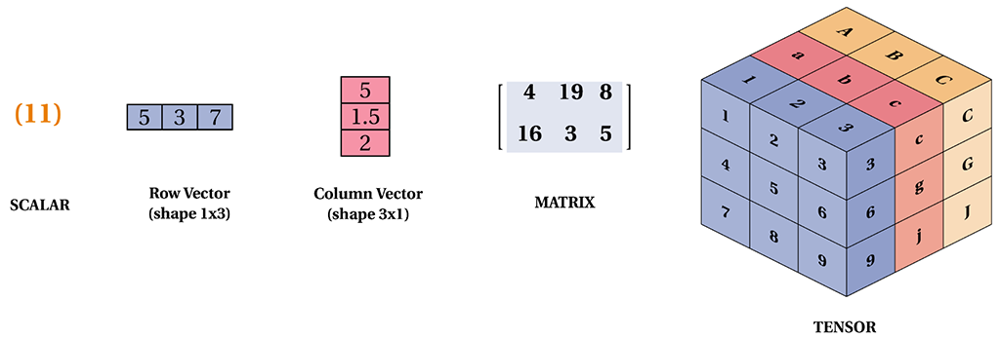
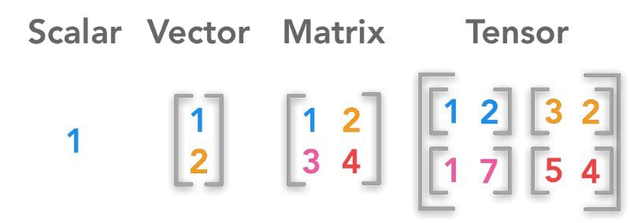
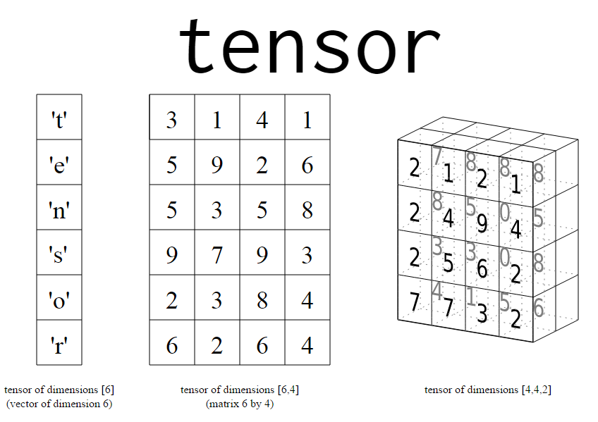
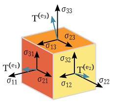

# Apuntes sobre Inteligencia Artificial

## Explicabilidad e Interpretabilidad

- **Explicabilidad** y **interpretabilidad** son conceptos clave en IA, especialmente cuando se trabaja con modelos complejos.
- A medida que el modelo se vuelve más complejo, es **menos explicable**; es más difícil para los humanos entender cómo se llegan a ciertas decisiones o predicciones.
- Sin embargo, la **interpretación** del modelo sigue siendo posible. Como dijo Raquel ayer: _"Si no lo puedo explicar, lo puedo interpretar."_
- La interpretación se refiere a la capacidad de comprender cómo funcionan internamente los modelos, incluso si no podemos explicarlos de manera simple.
- ¡Las parábolas funcionan! Por eso son una de las formas más antiguas de explicar cuestiones. Podemos encontrar dichas parábolas en cualquier texto antiguo desde la Epopeya de Gilgamesh hasta nuestro días, pasando por La Biblia.

## Complejidad en los Modelos

- Los modelos simples (como regresión lineal) son más fáciles de explicar e interpretar, pero pueden no ser tan poderosos como los modelos complejos (como redes neuronales profundas).
- La complejidad en los modelos se refiere al número de parámetros, capas, y las operaciones que se realizan dentro del modelo.
- **Modelos complejos** tienen mayor capacidad para capturar patrones en datos, pero también son más difíciles de interpretar y requieren más recursos computacionales.
- Actualmente se usan IAs para intentar explicar (e interpretar) IAs de caja negra. [Anthropic](https://www.anthropic.com/news/mapping-mind-language-model)
- [Google Académico](https://scholar.google.es/scholar?q=abstract+interpretation+ia&hl=es&as_sdt=0&as_vis=1&oi=scholart)

## Tensor

- Un **tensor** es una estructura de datos que puede representar escalares, vectores, matrices, y datos de mayor dimensión.
- Los tensores son fundamentales en la construcción de modelos de aprendizaje profundo, donde los datos se procesan y transforman a través de múltiples capas.

## Qué es TensorFlow

- **TensorFlow** es una biblioteca de código abierto para la construcción y entrenamiento de modelos de aprendizaje profundo.
- Desarrollada por Google, permite a los desarrolladores crear modelos de IA complejos utilizando tensores.
- TensorFlow es altamente utilizado para tareas de procesamiento de lenguaje natural, visión por computadora, y otros dominios de IA.

### Ejemplo de Tensores y TensorFlow

Imagina que estás trabajando en un proyecto de reconocimiento de imágenes utilizando **TensorFlow**. El objetivo es que el modelo pueda identificar diferentes tipos de frutas en imágenes.

1. **Entrada de Datos (Imágenes)**: 
   - Tienes un conjunto de imágenes de frutas: manzanas, naranjas, y plátanos.
   - Cada imagen es convertida en un **tensor** tridimensional (una matriz de números en 3D. Como un cubo de Rubik, pero lleno de numeritos y datos) que representa los píxeles de la imagen. Por ejemplo, una imagen de 28x28 píxeles con 3 canales de color (RGB) sería un tensor de dimensiones 28x28x3.
   
   
   
   

2. **Modelo de Aprendizaje Profundo**:
   - Este tensor tridimensional se pasa a través de una red neuronal profunda.
   - Cada capa de la red aplica operaciones matemáticas a los tensores (como multiplicaciones de matrices y funciones de activación) para extraer características de la imagen (bordes, formas, colores).

3. **Salida del Modelo**:
   - Al final, el modelo genera un tensor de salida, que podría ser un vector de probabilidades. Por ejemplo, `[0.1, 0.8, 0.1]` podría representar que la imagen tiene un 10% de probabilidad de ser una manzana, un 80% de ser una naranja, y un 10% de ser un plátano.

4. **Entrenamiento y Optimización**:
   - Durante el entrenamiento, **TensorFlow** ajusta los pesos de la red neuronal para minimizar la diferencia entre las predicciones y las etiquetas reales (manzana, naranja, plátano), usando tensores para actualizar los parámetros del modelo.

## Interpretación de un Tensor/Tensorflow

Imagina que los **tensores** son como hojas de cálculo (spreadsheets) que contienen números. Cada hoja tiene filas y columnas, y algunas hojas pueden tener múltiples capas (páginas).

1. **Tensores**:
   - Piensa en un tensor como una **pila de hojas de cálculo**. Una hoja sola puede ser una matriz 2D (por ejemplo, un mapa de calor de una imagen), pero cuando apilas varias hojas juntas, obtienes un tensor 3D.
   - Si cada página de la pila representa una capa de colores (rojo, verde, azul), entonces un tensor 3D podría representar una imagen en color.

2. **TensorFlow**:
   - Ahora, imagina que **TensorFlow** es como un **asistente súper eficiente** que puede tomar estas pilas de hojas (tensores) y realizar operaciones matemáticas complejas en ellas en cuestión de segundos.
   - Este asistente sigue una **receta precisa** (modelo de IA) para transformar tus datos de entrada (como imágenes) en algo útil (como la clasificación de frutas).
   - A medida que el asistente trabaja, ajusta y perfecciona la receta (entrenamiento), para que el resultado final (predicciones) sea lo más preciso posible.

## ¿Realmente se sigue trabajando de forma booleana?

- En los modelos de aprendizaje profundo, el procesamiento no es estrictamente booleano (verdadero/falso). Aunque las computadoras a nivel de hardware operan en lógica booleana, los modelos de IA funcionan con valores continuos.
- Las primeras versiones de modelos de IA sí trabajaban de manera binómica, pero en la actualidad la tecnología ha evolucionado. 
- En las redes neuronales, los valores de los nodos (o neuronas) pueden estar entre **0 y 1**, representando grados de activación. Esto permite una mayor flexibilidad y precisión en las decisiones y predicciones que realiza el modelo.

## Modelos Conceptuales Actuales

- Cada neurona en una red neuronal puede **representar varios conceptos**.
- **El conjunto** de neuronas trabajando en conjunto es lo que da sentido al modelo.
- **La estructuración de estos conceptos** a través de capas y conexiones es lo que nos permite entender cómo funciona la IA, aunque la interpretación detallada puede ser compleja.

## Agentes Implicados en IA

- **Meta** (anteriormente Facebook) invierte fuertemente en IA para mejorar la personalización y automatización en sus plataformas.
- **Microsoft** es un actor importante en IA, especialmente con su integración en herramientas de productividad y servicios en la nube.
- **OpenAI** es una organización líder en investigación de IA, conocida por desarrollar modelos avanzados como GPT.
- **Otros**: Hay muchas otras empresas e instituciones que contribuyen significativamente al desarrollo de IA, incluyendo Google, IBM, y universidades de todo el mundo.

## Requisitos para Ejecutar un Modelo de IA en un PC

- Para ejecutar un modelo de IA en un PC, se necesita:
  - **CPU** potente para procesar cálculos intensivos.
  - **GPU** (Unidad de Procesamiento Gráfico) para acelerar el entrenamiento de modelos, especialmente en aprendizaje profundo.
  - **VRAM** (memoria de video) suficiente para manejar grandes cantidades de datos gráficos y matrices durante el procesamiento.
  - **RAM** adecuada para soportar la carga de trabajo general del sistema y el almacenamiento temporal de datos.

## Qué es la VRAM y qué Diferencia Tiene con la RAM

- **VRAM** (Video RAM) es una memoria especializada en la tarjeta gráfica diseñada para almacenar y manejar imágenes y datos gráficos. Es crucial para aplicaciones de IA que requieren procesamiento paralelo intensivo.
- **RAM** (Memoria de Acceso Aleatorio) es la memoria general del sistema utilizada para almacenar datos temporales mientras se ejecutan aplicaciones.
- La VRAM es específicamente optimizada para manejar operaciones gráficas y de IA, mientras que la RAM es utilizada para la mayoría de las operaciones de software.

## Cómo Afecta la Tarjeta Gráfica

- La **tarjeta gráfica** (GPU) es fundamental para el rendimiento de los modelos de IA, especialmente en tareas de aprendizaje profundo. Las GPU están diseñadas para manejar grandes cantidades de cálculos en paralelo, lo que acelera significativamente el proceso de entrenamiento.
- La **VRAM** en la tarjeta gráfica permite manejar más datos simultáneamente, lo que es crucial para modelos grandes y complejos.
- La **capacidad de la GPU** y la cantidad de **VRAM** tienen un impacto directo en la eficiencia y velocidad con la que se pueden entrenar y ejecutar modelos de IA.
- Una GPU más poderosa con más núcleos y mayor VRAM permitirá manejar modelos más grandes y entrenarlos más rápido, lo que es crucial en aplicaciones avanzadas de IA.

## ¿Dónde puedo encontrar más información sobre IA?

- [DOTcsv](https://www.youtube.com/@DotCSV)
- [DOTcsv-Lab](https://www.youtube.com/@DotCSVLab)
- [Derivando](https://www.youtube.com/watch?v=_tA5cinv0U8)
- [Nate Gentile](https://www.youtube.com/@NateGentile7)
- [Salvaje](https://www.youtube.com/@SDESALVAJE) - Desde una perspectiva de usuario
- [Tutorial Flux y ComfyUI](https://www.youtube.com/watch?v=aTrapaTRi9A&t=804s) - Crea tu propio Midjourney
- [MiduDev](https://www.youtube.com/@midudev)
- [Portal de actualidad](https://www.xataka.com/) - En particular es buen comunicador [José García](https://www.xataka.com/autor/jose-garcia-nieto).
