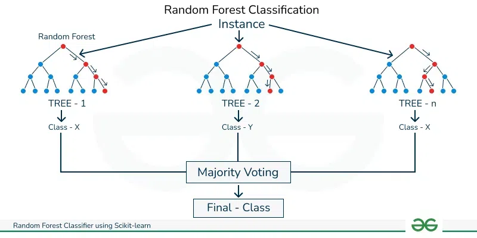

# Explicación Lab Titanic

## ¿Qué tipo de IA hemos usado?

En este lab del Titanic hemos utilizado un modelo de **Random Forest Classifier**, que es un algoritmo de Machine Learning supervisado perteneciente a la categoría de los **modelos de ensamble**. Un bosque aleatorio (Random Forest) se compone de múltiples árboles de decisión que, de manera colectiva, hacen predicciones más precisas y robustas.

## ¿Cómo ha sido entrenada?

El modelo se entrena utilizando un conjunto de datos que contiene las características de los pasajeros, como su clase, género, y el número de familiares a bordo. Además, incluye la columna **"Survived"**, que indica si cada pasajero sobrevivió o no. El entrenamiento consiste en alimentar el modelo con estos datos para que aprenda patrones y correlaciones entre las características de los pasajeros y su probabilidad de supervivencia.

## ¿Cómo ha aprendido los resultados?

El modelo aprende los resultados mediante el proceso de **entrenamiento supervisado**. En este proceso, se proporcionan los datos de entrada junto con sus etiquetas correspondientes (si sobrevivieron o no) para que el modelo aprenda a relacionar los datos con las etiquetas. Cada árbol dentro del bosque aleatorio aprende diferentes aspectos de los datos, y al final, el modelo toma una decisión basada en la votación de todos los árboles.

## ¿Cómo sabe si sobrevivieron o no?

El modelo predice si un pasajero sobrevivió o no en base a las características proporcionadas (como la clase, el sexo y el número de familiares a bordo). Tras el entrenamiento, cuando el modelo recibe nuevos datos de un pasajero, puede estimar su probabilidad de supervivencia utilizando los patrones aprendidos durante el entrenamiento.

## ¿Cómo la puedo poner a prueba?

Puedes poner a prueba el modelo utilizando los datos de prueba (**test data**) que no han sido vistos por el modelo durante el entrenamiento. Para esto, se hace una predicción sobre estos datos y se compara con los resultados reales de supervivencia. También puedes hacer una predicción con nuevos datos introduciendo manualmente las características de un pasajero y viendo si el modelo predice que sobrevivirá o no.

## Códigos de ejemplos

### Ratio de supervivencia por clase

```python
# Calcula el ratio de supervivencia por clase
for pclass in [1, 2, 3]:
    # Filtrar los pasajeros de la clase actual
    passengers_in_class = train_data.loc[train_data.Pclass == pclass]["Survived"]

    # Calcular el ratio de supervivencia (suma de sobrevivientes dividido entre total)
    survival_rate = sum(passengers_in_class) / len(passengers_in_class)

    # Mostrar el resultado por pantalla
    print(f"Supervivencia en clase {pclass}: {survival_rate:.2%}")
```

### Ratio de supervivencia de mujeres de primera clase y hombres de tercera clase

```python
# Ratio de supervivencia de mujeres en primera clase
women_first_class = train_data.loc[(train_data.Sex == 'female') & (train_data.Pclass == 1)]["Survived"]
rate_women_first_class = sum(women_first_class) / len(women_first_class)
print(f"Supervivencia de mujeres en primera clase: {rate_women_first_class:.2%}")

# Ratio de supervivencia de hombres en tercera clase
men_third_class = train_data.loc[(train_data.Sex == 'male') & (train_data.Pclass == 3)]["Survived"]
rate_men_third_class = sum(men_third_class) / len(men_third_class)
print(f"Supervivencia de hombres en tercera clase: {rate_men_third_class:.2%}")
```

### Ratio de supervivencia de mujeres vs hombres en cada clase

```python
# Función para calcular y mostrar el ratio de supervivencia para un grupo específico
def survival_rate_by_gender_and_class(sex, pclass):
    passengers = train_data.loc[(train_data.Sex == sex) & (train_data.Pclass == pclass)]["Survived"]
    return sum(passengers) / len(passengers)

# Mujeres y hombres en primera clase
rate_women_first_class = survival_rate_by_gender_and_class('female', 1)
rate_men_first_class = survival_rate_by_gender_and_class('male', 1)
print(f"Supervivencia de mujeres en primera clase: {rate_women_first_class:.2%}")
print(f"Supervivencia de hombres en primera clase: {rate_men_first_class:.2%}")

# Mujeres y hombres en segunda clase
rate_women_second_class = survival_rate_by_gender_and_class('female', 2)
rate_men_second_class = survival_rate_by_gender_and_class('male', 2)
print(f"Supervivencia de mujeres en segunda clase: {rate_women_second_class:.2%}")
print(f"Supervivencia de hombres en segunda clase: {rate_men_second_class:.2%}")

# Mujeres y hombres en tercera clase
rate_women_third_class = survival_rate_by_gender_and_class('female', 3)
rate_men_third_class = survival_rate_by_gender_and_class('male', 3)
print(f"Supervivencia de mujeres en tercera clase: {rate_women_third_class:.2%}")
print(f"Supervivencia de hombres en tercera clase: {rate_men_third_class:.2%")
```

## Explicación detallada del Random Forest Classifier

El **Random Forest Classifier** es un algoritmo de aprendizaje supervisado que se utiliza tanto para **clasificación** como para **regresión**. Se basa en la creación de un conjunto de **árboles de decisión** independientes entrenados sobre distintas partes de los datos, y su salida final es el resultado de la votación (en clasificación) o el promedio (en regresión) de todos los árboles.

### Funcionamiento básico:

1. **Árboles de decisión**: Un **árbol de decisión** es un modelo que toma decisiones dividiendo los datos en subconjuntos basados en características específicas. Cada árbol se entrena usando un subconjunto diferente del conjunto de datos (muestreo aleatorio), y en cada nodo, selecciona la característica que mejor divide los datos en términos de la variable objetivo (en este caso, si el pasajero sobrevivió o no).

2. **Ensamble de árboles**: En un Random Forest, se crean muchos árboles de decisión. Cada uno de ellos se entrena de manera ligeramente diferente, usando diferentes subconjuntos de datos (mediante una técnica llamada **bootstrap**). Esto introduce **diversidad** en los árboles y evita el sobreajuste que puede ocurrir con un único árbol de decisión.

3. **Predicción final**:
   - **Clasificación**: Cuando el modelo realiza una predicción, cada árbol del bosque vota por una clase. La clase con más votos es la predicción final del Random Forest.
   - **Regresión**: En lugar de votar, se promedian las salidas de los árboles.

### Ventajas del Random Forest:

- **Precisión**: El uso de múltiples árboles reduce el riesgo de sobreajuste y mejora la precisión general del modelo.
- **Robustez**: Los Random Forests son resistentes a los outliers y al ruido en los datos.
- **Importancia de características**: El Random Forest puede proporcionar medidas de la importancia de las características, lo que te permite saber qué variables están influyendo más en las predicciones.

### Parámetros clave en el modelo:

- **n_estimators**: Número de árboles en el bosque. Un número mayor tiende a mejorar la precisión, pero aumenta el costo computacional.
- **max_depth**: Profundidad máxima de los árboles. Controla cuán complejo puede ser cada árbol y ayuda a prevenir el sobreajuste.
- **random_state**: Fija la semilla para que los resultados sean reproducibles.
  

### ¿Cómo se aplica el Random Forest en lo del Titanic? (En lengua vernácula)

El **Random Forest Classifier** que estamos usando en este caso concreto del Titanic se encarga de predecir si un pasajero sobrevivió o no basándose en un conjunto de características. Vamos a ver cómo lo hace:

## ¿Qué hace el Random Forest?

Random Forest utiliza varias **características** de los pasajeros para intentar predecir si sobrevivieron. Las características clave que estamos utilizando son:

- **Pclass**: La clase del pasajero (1ra, 2da, 3ra).
- **Sex**: El género del pasajero (masculino o femenino).
- **SibSp**: Número de hermanos o cónyuges que tenía el pasajero a bordo.
- **Parch**: Número de padres o hijos que tenía el pasajero a bordo.

## Proceso paso a paso:

1. **Entrenamiento**:
   El modelo de Random Forest se entrena utilizando los datos históricos de pasajeros, que incluyen sus características y si sobrevivieron o no. Durante el entrenamiento, se crean múltiples **árboles de decisión**. Cada árbol aprende diferentes patrones a partir de diferentes subconjuntos de los datos.

   Esto es el entrenamiento y nosotros no vemos su resultado de forma directa.

2. **División de los datos**:
   Cada árbol de decisión divide los datos de los pasajeros en nodos, eligiendo una característica para hacer la división. Por ejemplo, un árbol puede dividir a los pasajeros primero por género (hombres y mujeres) y luego por clase (primera, segunda, tercera). Este proceso se repite para cada árbol.

   También va creando subgrupos, teniendo en cuenta por ejemplo "sexo" y "clase" a la vez. Esto va creciendo (esta vez sí) de forma exponencial. ¡Los árboles de decisiones crecen muy rápido!

3. **Predicción**:
   Para hacer predicciones sobre los datos de prueba, el modelo utiliza todos los árboles que creó durante el entrenamiento. Cada árbol hace su propia predicción (si el pasajero sobrevivió o no). Luego, el Random Forest **promedia las predicciones** de todos los árboles para dar una respuesta final.

   ### Predicción en detalle

   Una vez que el modelo de Random Forest ha sido entrenado, puede hacer predicciones sobre nuevos datos. Aquí está el proceso desglosado:

   ## A. Datos Nuevos

   Supongamos que tienes un nuevo pasajero con características como:

   - **Pclass**: 1 (primera clase)
   - **Sex**: 'female' (mujer)
   - **SibSp**: 0 (sin hermanos o cónyuges a bordo)
   - **Parch**: 1 (un padre o hijo a bordo)

   Estos datos son las entradas para las predicciones.

   ## B. Predicción con Cada Árbol

   1. **Entrada en los Árboles**:
      El nuevo pasajero se pasa a través de cada uno de los árboles en el Random Forest. Supongamos que hay 100 árboles en tu bosque.

   2. **Decisión de Cada Árbol**:
      Cada árbol hace una predicción sobre el nuevo pasajero. Cada árbol ha aprendido diferentes patrones durante el entrenamiento. Por ejemplo:

   - **Árbol 1**: Predice que el pasajero sobrevivió.
   - **Árbol 2**: Predice que el pasajero no sobrevivió.
   - **Árbol 3**: Predice que el pasajero sobrevivió.
   - ...y así sucesivamente para los 100 árboles.

   ## C. Votación o Promedio

   1. **Recolección de Predicciones**:
      Después de que cada árbol haya hecho su predicción, todas las predicciones se recogen. En nuestro caso, cada árbol emite un voto sobre si el pasajero sobrevivió o no.

   2. **Votación Mayoritaria**:
      En el caso de **clasificación** (que es lo que estamos haciendo), el Random Forest utiliza un método de votación mayoritaria:

   - Si la mayoría de los árboles predicen que el pasajero sobrevivió, entonces el Random Forest predice que el pasajero sobrevivió.
   - Si la mayoría de los árboles predicen que el pasajero no sobrevivió, entonces el Random Forest predice que el pasajero no sobrevivió.

   Por ejemplo, si 60 de los 100 árboles predicen que el pasajero sobrevivió y 40 predicen que no sobrevivió, la predicción final del Random Forest será que el pasajero sobrevivió.

   ## D. Resultado Final

   La predicción final del Random Forest se basa en la mayoría de votos de los árboles individuales. Este enfoque ayuda a hacer predicciones más precisas al combinar las decisiones de múltiples árboles, reduciendo así el riesgo de errores que podría cometer un solo árbol de decisión.

   ## Ejemplo Simplificado

   Imagina que tienes 5 árboles en lugar de 100 para simplificar:

   - **Árbol 1**: Predice que sobrevivió.
   - **Árbol 2**: Predice que no sobrevivió.
   - **Árbol 3**: Predice que sobrevivió.
   - **Árbol 4**: Predice que sobrevivió.
   - **Árbol 5**: Predice que no sobrevivió.

   Aquí, 3 árboles dijeron que sobrevivió y 2 dijeron que no sobrevivió. La **votación mayoritaria** decide que la predicción final es que el pasajero sobrevivió.

4. **Predicción final**:
   La predicción final es el resultado de la **votación** entre todos los árboles. Si la mayoría de los árboles predicen que el pasajero sobrevivió, esa será la predicción final del Random Forest. El cómo se llega a esta predicción final te lo he escrito bien detallado en la aclaración del punto 3.

## Ejemplo de código: Entrenamiento del Random Forest

En este caso, entrenamos el Random Forest usando las características mencionadas y la columna **"Survived"** como etiqueta objetivo.

```python
from sklearn.ensemble import RandomForestClassifier

# Definir la variable objetivo y las características
y = train_data["Survived"]
features = ["Pclass", "Sex", "SibSp", "Parch"]
X = pd.get_dummies(train_data[features])
X_test = pd.get_dummies(test_data[features])

# Crear el modelo de Random Forest
model = RandomForestClassifier(n_estimators=100, max_depth=5, random_state=1)

# Entrenar el modelo con los datos de entrenamiento
model.fit(X, y)
```

### Explicación de parámetros importantes:

- **n_estimators=100**: Esto indica que estamos creando 100 árboles de decisión dentro del Random Forest.
- **max_depth=5**: Controla la profundidad máxima de los árboles, evitando que se vuelvan demasiado complejos y se sobreajusten.
- **random_state=1**: Fija la semilla para que los resultados sean reproducibles. ¡Anulamos las semillas random que vimos el otro día! Esto es un caso de modelo determinista :)
- Si no quieres que sea determinista, deberías escribir `random_state=none`.

## Ejemplo de código: Predicciones y evaluación

Después de entrenar el modelo, podemos hacer predicciones sobre los datos de prueba y guardar los resultados en un archivo CSV para la evaluación final.

```python
# Hacer predicciones con el modelo entrenado
predictions = model.predict(X_test)

# Crear un DataFrame para las predicciones y guardarlas en un archivo CSV
output = pd.DataFrame({'PassengerId': test_data.PassengerId, 'Survived': predictions})
output.to_csv('submission.csv', index=False)

print("¡Tu predicción ha sido guardada correctamente!")
```

## Ejemplo concreto de cómo predice el modelo

Imaginemos que tenemos un pasajero con las siguientes características:

- **Pclass**: 2 (segunda clase)
- **Sex**: 'female' (mujer)
- **SibSp**: 1 (viajaba con un hermano o cónyuge)
- **Parch**: 0 (sin padres o hijos a bordo)

Este conjunto de características se pasa por cada uno de los 100 árboles de decisión dentro del Random Forest. Algunos árboles pueden dividir los datos primero por **Sex**, determinando que este pasajero es una mujer, lo que aumenta su probabilidad de supervivencia. Otros árboles pueden dividir primero por **Pclass**, asignando una menor probabilidad de supervivencia en comparación con pasajeros de primera clase.

Cada árbol hará una predicción, y el Random Forest agregará estas predicciones para decidir si el pasajero probablemente sobrevivió o no.

## ¿Cómo mejora el Random Forest la precisión?

A diferencia de usar un solo árbol de decisión, que podría tomar decisiones demasiado específicas y sobreajustarse a los datos de entrenamiento, el Random Forest combina muchos árboles, lo que ayuda a:

- **Reducir el riesgo de sobreajuste**: Cada árbol es independiente y toma decisiones con subconjuntos diferentes de datos.
- **Mejorar la generalización**: El modelo final es una agregación de muchos árboles, lo que da un resultado más equilibrado y robusto para hacer predicciones sobre datos no vistos.

# ¿Sigues sin verlo del todo claro?

## Ejemplo hiper-concreto y super bajado a la tierra

Vamos a poner un ejemplo absolutamente alejado de lo del Titanic. Para ello supongamos lo siguiente:

- Quiero entregar un bosque con 3 parámetros. "Altura", "Peso" y "Edad".
- Para ello aporto un total de 20 datos de personas, caracterizadas por estos tres parámetros.

## ¿Cómo se crearía un bosque de 30 árboles?

Vamos a desglosar cómo se podría construir un Random Forest con 30 árboles utilizando un conjunto de datos de 20 personas.

Supongamos que tienes un conjunto de datos con 20 personas, donde cada persona tiene valores para "Altura", "Peso" y "Edad". Estos datos se verían algo así:

| Persona | Altura (cm) | Peso (kg) | Edad (años) | Supervivencia |
| ------- | ----------- | --------- | ----------- | ------------- |
| 1       | 170         | 70        | 30          | 1             |
| 2       | 160         | 60        | 25          | 0             |
| ...     | ...         | ...       | ...         | ...           |
| 20      | 175         | 80        | 40          | 1             |

## Construcción del Random Forest

Para construir un Random Forest con 30 árboles, seguimos estos pasos:

### 1. Creación de Muestras Bootstrap

Para cada uno de los 30 árboles, se crea una muestra bootstrap (muestra aleatoria con reemplazo, vamos, que tras usarla la devuelves al conjunto de muestras, por lo que "no se gastan") del conjunto de datos original. Ejemplos de muestras bootstrap podrían ser:

- **Árbol 1**: Puede recibir una muestra bootstrap que incluya las personas 1, 3, 5, 7, 9, y repeticiones como 2, 4, etc.
- **Árbol 2**: Puede recibir una muestra bootstrap diferente con personas 2, 4, 6, 8, 10, y algunas repeticiones.

### 2. Selección de Características Aleatorias

En cada división de cada árbol, se selecciona aleatoriamente un subconjunto de las características ("Altura", "Peso", "Edad") para decidir la mejor división. Ejemplos:

- **División 1**: En una división específica, se podría seleccionar aleatoriamente "Altura" y "Edad".
- **División 2**: En otra división, se podría seleccionar "Peso" y "Edad".

#### Más ejemplos:
##### Ejemplo 1
- **División**: Altura <= 160 cm
  - **Izquierda**: Registros con Altura <= 160 cm
  - **Derecha**: Registros con Altura > 160 cm

##### Ejemplo 2
- **División**: Peso > 70 kg
  - **Izquierda**: Registros con Peso <= 70 kg
  - **Derecha**: Registros con Peso > 70 kg

##### Ejemplo 3
- **División**: Edad <= 30 años
  - **Izquierda**: Registros con Edad <= 30 años
  - **Derecha**: Registros con Edad > 30 años

##### Ejemplo 4
- **División**: Altura > 175 cm
  - **Izquierda**: Registros con Altura <= 175 cm
  - **Derecha**: Registros con Altura > 175 cm

##### Ejemplo 5
- **División**: Peso <= 60 kg
  - **Izquierda**: Registros con Peso <= 60 kg
  - **Derecha**: Registros con Peso > 60 kg

### 3. Construcción de Árboles

Cada árbol se construye de manera independiente utilizando su muestra bootstrap y las características seleccionadas aleatoriamente en cada división.

### 4. Predicción

Cuando se usa el modelo para hacer predicciones:

- **Cada Árbol**: Hace una predicción individual basada en su propio entrenamiento.
- **Votación**: La predicción final del Random Forest se determina por la votación mayoritaria de las 30 predicciones de los árboles.

## Ejemplo Detallado

### Datos de Entrenamiento

Supongamos que uno de los árboles se entrena con la siguiente muestra bootstrap:

| Persona | Altura (cm) | Peso (kg) | Edad (años) | Supervivencia |
|---------|-------------|-----------|-------------|---------------|
| 1       | 170         | 70        | 30          | 1             |
| 1       | 180         | 70        | 30          | 1             |
| 2       | 160         | 60        | 25          | 0             |
| 3       | 165         | 65        | 35          | 1             |
| ...     | ...         | ...       | ...         | ...           |

### Construcción del Árbol

1. **División Inicial**:
   - **Considera**: "Altura" y "Edad".
   - **División**: Puede dividirse en dos grupos basados en "Altura" > 165 cm y "Altura" <= 165 cm.

2. **Siguientes Divisiones**:
   - Dentro de los grupos creados, se seleccionan aleatoriamente características para hacer más divisiones.

### Ejemplo de Predicción

Para un nuevo dato con:
- **Altura**: 172 cm
- **Peso**: 75 kg
- **Edad**: 32 años

Cada uno de los 30 árboles hace una predicción basada en su entrenamiento y estructura. La predicción final del Random Forest es la votación mayoritaria entre las 30 predicciones de los árboles.

