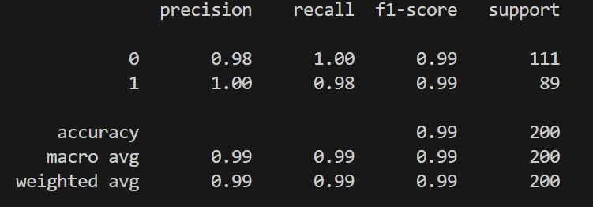
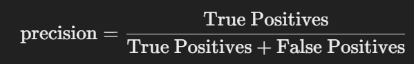
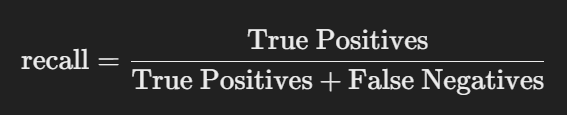
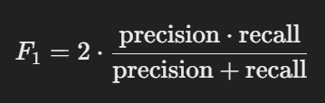
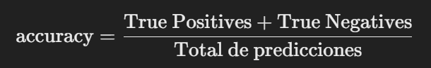

# ¿Por qué no consigo más de un 50% de accuracy con mi modelo RandomForest?

### Introducción
Estás entrenando un modelo de clasificación **RandomForest** para predecir la variable `finalizaCompra`, pero te enfrentas a un rendimiento consistentemente bajo, por debajo del 50% de accuracy. Esto puede ser frustrante, vamos a ver qué es lo que está pasando.

### 1. Desequilibrio en las clases (*Class Imbalance*)
Este es uno de los sospechosos habituales cuando un modelo tiene un rendimiento bajo. El **desequilibrio de clases** ocurre cuando una de las clases en la variable objetivo tiene significativamente más ejemplos que la otra. Por ejemplo, si el 90% de los casos son "no compra" y solo el 10% son "compra", el modelo puede simplemente predecir "no compra" para casi todo y aún así obtener un accuracy alto, aunque esté haciendo predicciones terribles para la clase minoritaria.

#### Solución:
Primero, verifica si tienes un desequilibrio en las clases de tu variable objetivo:

```python
print(train_data['finalizaCompra'].value_counts())
```

Si descubres que una clase es mucho más frecuente que la otra, tienes varias opciones:
- **Reamostrado** (*resampling*): Puedes reducir la clase mayoritaria o aumentar la clase minoritaria para balancear los datos.
- Usar la opción `class_weight='balanced'` en tu modelo de `RandomForestClassifier`. Esto ajusta automáticamente los pesos de las clases en función de su frecuencia, dándole más importancia a la clase minoritaria.

```python
model = RandomForestClassifier(n_estimators=arboles, max_depth=profundidad, random_state=1, class_weight='balanced')
```

Esto puede mejorar la forma en que el modelo trata la clase minoritaria y, en consecuencia, su rendimiento general.

Sin embargo, este no es nuestro problema :O

### 2. Features irrelevantes o mal procesadas
El problema podría estar en las **características (features)** que estás usando. Algunas variables simplemente no aportan información relevante al modelo o pueden estar mal representadas. Por ejemplo, si tienes una columna como `veDragonBall` que no parece tener relación con la compra de productos, podrías estar introduciendo ruido en el modelo.

Claro, en este caso no sabemos qué vende nuestra tienda... igual vendemos figuritas de DragonBall y entonces eso sí podría ser relevante. Pero a la vez parece que tenemos en consideración si el cliente tiene coche y carnet... vamos, que a más datos no siempre es mejor. ¡A esto nos referimos cuando hablamos de curar los datos!

Por aquí sí que vamos viendo parte del problema. No se ha hecho un estudio correcto del cliente y de la correlación entre las variables. ¡Simplemente añadimos lo de Dragon Ball porque nos gustaba demasiado como para no ponerlo!

#### Solución:
- Realiza una **selección de características** para identificar las que realmente están aportando valor a tu predicción.
- Prueba eliminar algunas características irrelevantes o utiliza métodos como **correlación** o **importancia de las características** para decidir qué variables son realmente útiles.
- Además, asegúrate de que las variables categóricas estén correctamente codificadas (es decir, transformadas en variables numéricas) con `pd.get_dummies`.

### 3. Sobreajuste (*Overfitting*)
El sobreajuste es otro enemigo común en machine learning. Si tu modelo tiene un alto número de árboles y mucha profundidad, puede estar aprendiendo demasiado bien los detalles de los datos de entrenamiento, pero fallar al generalizar en los datos de prueba o validación.

Es como ese estudiante que memoriza todas las preguntas del examen anterior pero no sabe cómo responder algo ligeramente diferente.

#### Solución:
- Ajusta los hiperparámetros como `n_estimators` y `max_depth` para que no sean tan grandes y el modelo no termine sobreajustándose. (Vamos, que hay que dar con la cantidad justa de árboles y de profundidad)
- Utiliza **validación cruzada** (*cross-validation*) para evaluar el rendimiento del modelo de manera más precisa. Esto te permitirá verificar si el modelo está sobreajustando en tus datos de entrenamiento.

```python
from sklearn.model_selection import cross_val_score
scores = cross_val_score(model, X, y, cv=5)
print(f"Cross-validation scores: {scores}")
print(f"Mean cross-validation score: {np.mean(scores)}")
```

Esto te dará una visión más clara de cómo se comporta el modelo en diferentes particiones de los datos.

En nuestro caso, vemos que el problema del modelo parece ser un problema generalizado.

### 4. Ruido en los datos
A veces, los datos en sí son el problema. Si los datos contienen errores, inconsistencias o simplemente ruido (información irrelevante), el modelo puede tener problemas para aprender patrones útiles.

#### Solución:
- **Limpieza de datos**: Asegúrate de eliminar valores atípicos, datos faltantes y errores en tus datos. Un dataset limpio es la base de un buen modelo.
- Considera realizar técnicas como **normalización** o **estandarización** de los datos si las características numéricas tienen diferentes escalas.

### 5. Alineación de columnas
Un problema sutil pero importante puede ocurrir si las columnas entre el conjunto de entrenamiento (`X_train`) y el conjunto de prueba (`X_test`) no están bien alineadas. Después de usar `pd.get_dummies`, las columnas categóricas pueden haberse transformado de manera diferente en ambos conjuntos, lo que puede causar problemas al aplicar el modelo.

#### Solución:
Asegúrate de que los conjuntos de datos de entrenamiento y prueba tengan exactamente las mismas columnas:

```python
X, X_test = X.align(X_test, join='left', axis=1, fill_value=0)
```

Este paso es clave para evitar problemas de alineación. Aunque nosotros aquí tampoco estamos fallando.

### 6. Datos insuficientes
Si no tienes suficientes datos, el modelo podría no estar aprendiendo los patrones correctamente. En machine learning, más datos suelen ayudar a mejorar el rendimiento, siempre y cuando los datos adicionales sean relevantes y no redundantes.

#### Solución:
Si tienes pocos datos, puedes:
- Intentar conseguir más datos (si es posible).
- Aplicar técnicas de **generación de datos sintéticos**, como **SMOTE** (Synthetic Minority Over-sampling Technique) si el problema es el desequilibrio de clases.

### 7. Métrica de evaluación
Es posible que el **accuracy** no sea la métrica más adecuada para evaluar el rendimiento de tu modelo, especialmente en casos de desequilibrio de clases. Otras métricas como la **precisión** (*precision*), el **recall**, o el **AUC-ROC** pueden darte una mejor idea de cómo está funcionando tu modelo.

#### Solución:
Utiliza otras métricas de evaluación para obtener una imagen más completa del rendimiento de tu modelo:

```python
from sklearn.metrics import classification_report
print(classification_report(y_valid, y_pred))
```



#### ¿Cómo se lee esto?

El reporte que genera `classification_report` en scikit-learn proporciona varias métricas clave para evaluar el rendimiento de tu modelo de clasificación. Vamos a desglosarlo en partes para entender cada métrica:

### 1. Métricas por clase (`0` y `1`)

Cada fila del reporte se refiere a una clase, en este caso, las clases son `0` (probablemente "no compra") y `1` (probablemente "compra"). Estas son las métricas reportadas para cada clase:

- **precision (Precisión)**: 
  - Para la clase `0` es `0.98`, lo que significa que de todas las predicciones que el modelo hizo como clase `0`, el 98% eran correctas.
  - Para la clase `1`, es `1.00`, lo que significa que todas las predicciones que el modelo hizo como clase `1` fueron correctas.

  **Fórmula**:  
  

- **recall (Sensibilidad o Tasa de Verdaderos Positivos)**:
  - Para la clase `0`, es `1.00`, lo que significa que el modelo identificó correctamente todos los ejemplos de la clase `0`.
  - Para la clase `1`, es `0.98`, lo que significa que el 98% de los ejemplos de la clase `1` fueron correctamente identificados como tales.

  **Fórmula**:  
  

- **f1-score**:
  - Es la media armónica de la precisión y el recall, proporcionando una métrica única que balancea ambas. Para la clase `0`, es `0.99`, y para la clase `1`, también es `0.99`. Es una buena métrica para evaluar el rendimiento global cuando hay un desequilibrio entre precisión y recall.

  **Fórmula**:
  

- **support**:
  - Indica el número total de instancias reales para cada clase. Aquí tienes 111 ejemplos de la clase `0` y 89 de la clase `1` en el conjunto de validación. No es una métrica de rendimiento, sino una indicación de cuántos ejemplos pertenecen a cada clase.

### 2. Accuracy (Precisión global)

- **accuracy**: `0.99`
  - Este es el porcentaje de predicciones correctas hechas por el modelo en general. Significa que el 99% de todas las predicciones fueron correctas.

  **Fórmula**:
  

### 3. Métricas agregadas (macro avg y weighted avg)

- **macro avg (Promedio macro)**:
  - Calcula el promedio de precisión, recall y f1-score de cada clase sin ponderar por el tamaño de la clase. Esto significa que se trata cada clase por igual, independientemente de cuántos ejemplos haya en cada una.

- **weighted avg (Promedio ponderado)**:
  - Es el promedio de precisión, recall y f1-score ponderado por el número de ejemplos en cada clase. Esto significa que las clases con más ejemplos tienen mayor impacto en las métricas globales.

### ¿Cómo interpretarlo en conjunto?

- **Precisión alta**: El modelo rara vez clasifica incorrectamente una clase como otra, ya que la precisión es muy alta para ambas clases (`0.98` y `1.00`).
- **Recall alto**: El modelo es excelente identificando correctamente las clases verdaderas (`1.00` y `0.98`).
- **f1-score alto**: Tanto la precisión como el recall están equilibrados, lo que se refleja en el f1-score de `0.99` para ambas clases.
- **Support balanceado**: Aunque no es exactamente equilibrado, hay una cantidad razonable de ejemplos de ambas clases (`111` para clase `0` y `89` para clase `1`), por lo que las métricas son confiables para ambas.
