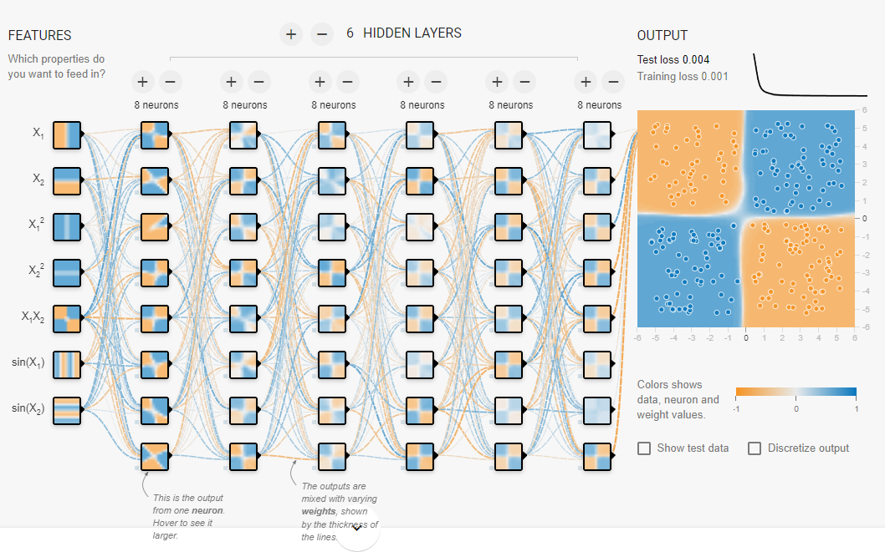
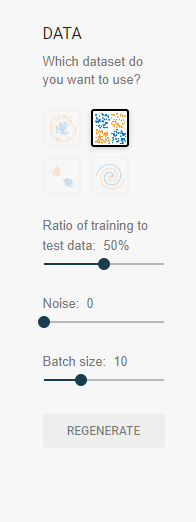
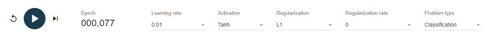

# TensorFlow Playground: Guía para Bootcamp de IA

## Introducción

El **TensorFlow Playground** es una herramienta interactiva que permite explorar cómo funcionan las redes neuronales de forma visual. 

Vamos a echar un vistazo, punto por punto, a qué es cada cosa. Recuerda que también tienes la grabación de la clase.

## 1. Interfaz General

- **Entrada (Input)**: A la izquierda encontrarás las características de entrada (x1 y x2), que son los datos que la red neuronal va a utilizar para entrenar.
- **Red neuronal (Neural Network)**: En el centro, verás la red neuronal representada con sus capas y neuronas. Puedes modificar la estructura agregando más neuronas o capas.
- **Salida (Output)**: A la derecha verás el resultado de la red neuronal, que intenta predecir la clase o categoría de cada punto de datos.

## 2. Dataset (Conjunto de Datos)

En la parte izquierda, puedes elegir diferentes conjuntos de datos para entrenar la red. Verás que pone `DATA` así, en mayúsculas:

- **Círculos concéntricos**: Un conjunto de datos con patrones circulares.
- **XOR (X shaped)**: Un conjunto de datos en forma de X.
- **Clusters (Grupos)**: Datos organizados en grupos separados.
- **Spiral (Espiral)**: Un conjunto de datos en espiral.
- **Ratio of training to test data**: La cantidad de datos base que vamos a utilizar para el entrenamiento.
- **Noise (Ruido)**: Añade ruido a los datos de entrada, lo que puede hacer el problema más difícil.
- **Batch size**: La cantidad de tamaño que tiene que tener el modelo antes de actualizar los pesos. A más alto, más tarda y más memoria consume pero más ajustado queda.

Estos conjuntos de datos están etiquetados para que la red intente clasificarlos en distintas categorías.

## 3. Parámetros Ajustables

El Playground permite ajustar varios parámetros clave, verás esta barra arriba del todo:

- **Learning Rate (Tasa de Aprendizaje)**: Controla qué tan rápido la red ajusta sus pesos durante el entrenamiento. 
  - Tasa alta: entreno rápido, pero puede ser inestable.
  - Tasa baja: entreno lento, pero puede ser más preciso.
  - El ejemplo base está en un valor intermedio, `0.01`.

- **Activation (Función de Activación)**: Define cómo una neurona procesa la información. Algunas opciones comunes son:
  - **ReLU**: Función lineal a trozos.
  - **tanh**: Escala las salidas entre -1 y 1.

- **Regularization (Regularización)**: Ayuda a prevenir el sobreajuste (*overfitting*) al penalizar los pesos grandes. 
  - **L1**: Penaliza pesos absolutos.
  - **L2**: Penaliza el cuadrado de los pesos.

- **Problem Type (Tipo de Problema)**: Puedes seleccionar entre regresión o clasificación. Generalmente está configurado para clasificación.

## 4. Entrenar la Red Neuronal

Haz clic en **el play** para entrenar la red. Durante el entrenamiento, verás:

- El área de decisión creada por la red (cómo clasifica los datos).
- Los colores que representan las predicciones de la red para cada categoría.

### Visualización de la Red

- Conexiones azules: Representan pesos positivos.
- Conexiones naranjas: Representan pesos negativos.
- Los colores dentro de las neuronas indican el nivel de activación según los datos de entrada.

## 5. Interpretación de Resultados

A medida que entrenas la red, puedes observar cómo cambia la **área de decisión**. Algunas notas importantes:

- **Overfitting (Sobreajuste)**: Si tienes demasiadas capas o neuronas, la red puede sobreajustar los datos de entrenamiento, lo que significa que se ajustará demasiado a los datos de entrenamiento y no generalizará bien con datos nuevos.
- **Underfitting (Subajuste)**: Si tienes pocas neuronas o capas, la red puede no ser capaz de captar la complejidad del conjunto de datos.
